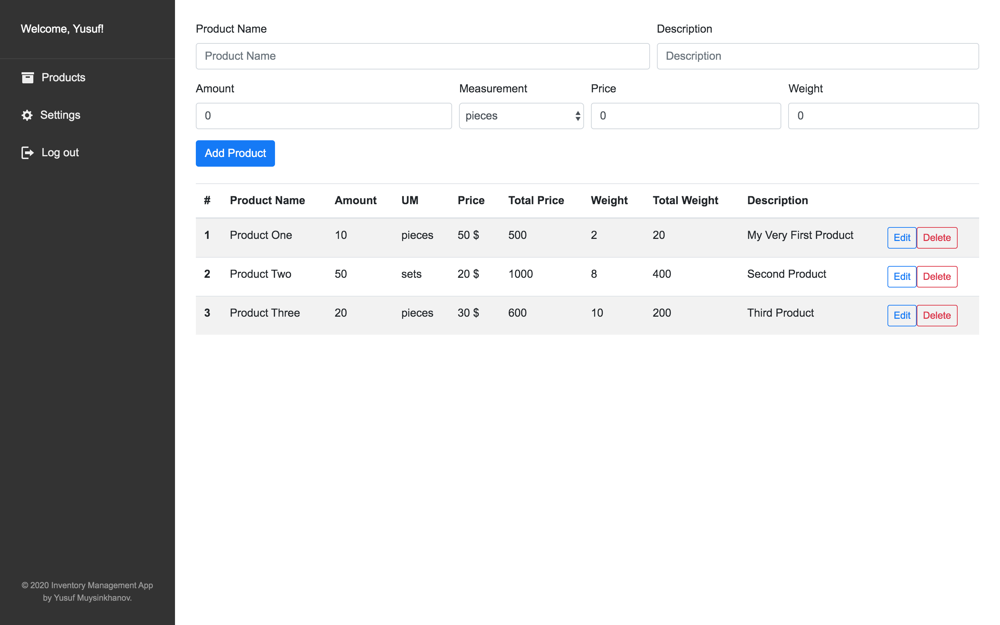

# Inventory Management App

A simple ***Inventory Management*** web application with basic CRUD operations and Authentication built using MERN stack.



_Live Demo is under maintenance..._

Account details:
- Email: test@test.com
- Password: 123456

## Technology
This project uses the following technologies:

- **Front-end**: React, React Router, Redux, Sass

- **Back-end**: Node, Express, MongoDB, Mongoose, PassportJS (local)

## Configuration
Add your own `MongoURI` from your Mongo Atlas database in `./config/keys.js`

```
module.exports = {
  mongoURI: "YOUR_MONGO_URI",
  sessionSecret: "SECRET_WORD"
};
```

## Quick Start

Make sure you have **Node** (version: `12.14.0` or above) installed in your system.

```
// Install dependencies for server & client
npm install && npm run install:client

// Run client and server with concurrently
npm run dev

// Server runs on http://localhost:5000 and client on http://localhost:3000
```

## Upcomings
- User Profile page
- User Settings page
- Refactoring the codebase
